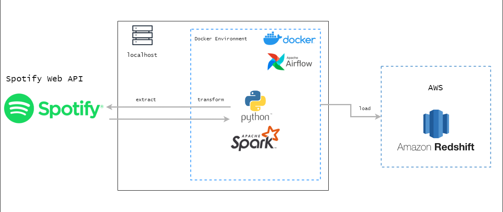

# ETL-Spotify | Data Engineering Project



## Descripción del Proyecto

Repositorio para el proyecto final del curso Data Engineering en [CODERHOUSE](https://www.coderhouse.com/).

Este proyecto tiene como propósito llevar a cabo un proceso ETL (Extract, Transform, Load) utilizando datos extraídos de la WEB API de [Spotify](https://developer.spotify.com/documentation/web-api/tutorials/getting-started). A través de este proceso, se extraerá información relevante del catálogo de Spotify sobre el top 10 de las mejores canciones de un artista por país. Luego, se realizará una transformación de los datos para adecuarlos al formato necesario y finalmente se cargarán en AWS Redshift, una base de datos en la nube de Amazon.

### Automatización con Apache Airflow

Todo el flujo de trabajo ETL se encuentra automatizado mediante el uso de Apache Airflow, una plataforma de orquestación de tareas. Airflow permite programar, monitorear y ejecutar las diferentes etapas del proceso ETL de manera eficiente y confiable. Además, en caso de que alguna de las tareas falle, se ha configurado un sistema de alertas por correo electrónico para notificar a los responsables y tomar acciones rápidas para solucionar cualquier problema.

### Objetivo

El objetivo principal de este proyecto es proporcionar una solución automatizada para obtener y analizar datos del catálogo de Spotify. Con el proceso ETL implementado, podremos obtener información valiosa sobre las mejores canciones de un artista en diferentes países, lo que puede ser útil para la toma de decisiones y el análisis de tendencias musicales.

## Tabla de Contenidos

-   [Descripción del Proyecto](#descripción-del-proyecto)
-   [Requisitos](#requisitos)
-   [Instalación](#instalación)
-   [Estructura del Proyecto](#estructura-del-proyecto)
-   [Licencia](#licencia)

## Requisitos

1. Registrarse en la API de [Spotify](https://developer.spotify.com/documentation/web-api/tutorials/getting-started) siguiendo los pasos que te proporciona. Con esto obtendremos los siguientes datos:
    - CLIENT_ID
    - CLIENT_SECRECT
2. Tener instalado [Docker](https://www.docker.com/) en tu laptop.
3. Tener una cuenta en AWS o reemplazar las conexiones por una DB en localhost, por ejemplo, PostgreSQL.
4. Generar una contraseña para aplicaciones de terceros en [Gmail](https://support.google.com/mail/answer/185833?hl=es-419&ref_topic=3394217&sjid=13457642915339293739-SA)

## Instalación

1. Crear las siguientes carpetas a la misma altura del `docker-compose.yml`.
```bash
mkdir logs
mkdir plugins
mkdir postgres_data
```
2. Crear un archivo con variables de entorno llamado `.env` ubicado a la misma altura que el `docker-compose.yml`. Cuyo contenido sea:
```bash
REDSHIFT_HOST=... # YOUR_REDSHIFT_HOST
REDSHIFT_PORT=... # YOUR_REDSHIFT_PORT
REDSHIFT_DB=... # YOUR_REDSHIFT_DB
REDSHIFT_USER=... # YOUR_REDSHIFT_USER
REDSHIFT_SCHEMA=... # YOUR_REDSHIFT_SCHEMA
REDSHIFT_PASSWORD=... # YOUR_REDSHIFT_PASSWORD
REDSHIFT_URL="jdbc:postgresql://${REDSHIFT_HOST}:${REDSHIFT_PORT}/${REDSHIFT_DB}?user=${REDSHIFT_USER}&password=${REDSHIFT_PASSWORD}"
DRIVER_PATH=/tmp/drivers/postgresql-42.5.2.jar
SPOTIFY_CLIENT_ID="YOUR_CLIENT_ID"
SPOTIFY_CLIENT_SECRET="YOUR_CLIENT_SECRET"
```
3. Descargar las imagenes de Airflow y Spark. En caso de error al descargar las imagenes, debe hacer un login en DockerHub.
```bash
docker pull lucastrubiano/airflow:airflow_2_6_2
docker pull lucastrubiano/spark:spark_3_4_1
```
4. Las imagenes fueron generadas a partir de los Dockerfiles ubicados en `docker_images/`. Si se desea generar las imagenes nuevamente, ejecutar los comandos que están en los Dockerfiles.
5. Ejecutar el siguiente comando para levantar los servicios de Airflow y Spark.
```bash
docker-compose up --build
```
6. Una vez que los servicios estén levantados, ingresar a Airflow en `http://localhost:8080/`.
7. En la pestaña `Admin -> Connections` crear una nueva conexión con los siguientes datos para Redshift:
    * Conn Id: `redshift_default`
    * Conn Type: `Amazon Redshift`
    * Host: `host de redshift`
    * Database: `base de datos de redshift`
    * Schema: `esquema de redshift`
    * User: `usuario de redshift`
    * Password: `contraseña de redshift`
    * Port: `5439`
8. En la pestaña `Admin -> Connections` crear una nueva conexión con los siguientes datos para Spark:
    * Conn Id: `spark_default`
    * Conn Type: `Spark`
    * Host: `spark://spark`
    * Port: `7077`
    * Extra: `{"queue": "default"}`
9. En la pestaña `Admin -> Variables` crear una nueva variable con los siguientes datos:
    * Key: `driver_class_path`
    * Value: `/tmp/drivers/postgresql-42.5.2.jar`
10. En la pestaña `Admin -> Variables` crear una nueva variable con los siguientes datos:
    * Key: `spark_scripts_dir`
    * Value: `/opt/airflow/scripts`
11. En la pestaña `Admin -> Variables` crear las nuevas variables con los siguientes datos:
    * Key: `SMTP_EMAIL_FROM`
    * Value: `your_email_from@example.com`
    * Key: `SMTP_EMAIL_PASSWORD`
    * Value: `your_smtp_password`
    * Key: `SMTP_EMAIL_TO`
    * Value: `your_email_to@example.com`
12. Ejecutar el DAG `etl_spotify`.

## Estructura del Proyecto

    📁dags
        etl_spotify.py
    📁docker_images
        📁airflow
            Dockerfile
            requirements.txt
        📁spark
            Dockerfile
    📁plugins
    📁logs
    📁postgres_data
    📁scripts
        commons.py
        ETL_Spotify.py
        helpers.py
    .gitignore
    .env
    docker-compose.yml
    README.md

### Tabla: popular_songs

Esta tabla almacena información sobre canciones populares. A continuación se muestra la descripción de sus columnas:

| Columna | Tipo de dato | Descripción |  
|  -------------- | ------------ | ---------------------------------------|  
| id_song |  VARCHAR(250)  | Identificador único de la canción. |  
| song_name |  VARCHAR(250) | Título de la canción. |  
| artist |  VARCHAR(250) | Nombre del artista o banda. |
| album  |  VARCHAR(150) | Nombre del álbum. |
| popularity | INTEGER | Popularidad de la canción. |
| duration_ms | INTEGER  | Duración de la canción en milisegundos. |
| song_link  | VARCHAR(250)  | Link de la canción. |
| country_code  | VARCHAR(2)  | Código del país donde se escucha la canción. |
| timestamp_  | TIMESTAMP  | Marca de tiempo en que se ejecuta el etl. |
| alternate_key  | VARCHAR(255) | Identificador alternativo usado como PRIMARY KEY |


## Licencia
Este proyecto se encuentra bajo la [Licencia MIT](LICENSE.txt)
    

## Contacto
Hola 👋 ¿Cómo estás? Si te gustó este proyecto y quieres saber más, puedes contactarme por algunas de estas redes 🙂

✉ lautaropoletto@gmail.com

👨‍💻 https://github.com/lpoletto

🙋‍♂️ https://www.linkedin.com/in/lautaro-poletto/ 


## Créditos

Algunos de los recursos utilizados en el proyecto fueron creados por el Profesor Lucas Trubiano. 👉 https://github.com/lucastrubiano